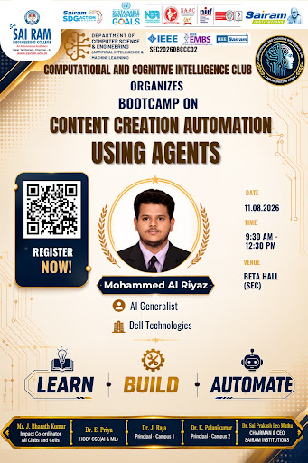

# 🧠 CCIC AIML Club Portal

<div align="center">



**Center for Computational Intelligence and Cognition (CCIC)**  
*Department of Computer Science & Engineering (Artificial Intelligence & Machine Learning)*  
**Sri Sairam Engineering College (Autonomous)** • Chennai, Tamil Nadu, India  
*Affiliated: IEEE EMBS • IEEE Madras Section • AICTE Approved • NIRF Rank 157 • ARIIA Top 25*

---

[](https://vercel.com)
[](https://python.org)
[](https://tailwindcss.com)
[](https://sheetjs.com)
[](LICENSE)

</div>

---

## 📖 Overview

The **CCIC AIML Club Portal** is a web platform designed for the flagship AI research club of **Sri Sairam Engineering College**. Built using the modern **Cognitive Neural Academic Design System** (Space Grotesk + Plus Jakarta Sans typography), this portal combines student recruitment, research cohort showcases, and an administrative control board into a high-performance single-page application.

The project is structured to deploy to **Vercel** with zero-configuration, while also providing a **Python (Flask)** backend with **SQLite**, automatic **Excel (.xlsx)** / **CSV** synchronizer, and **Firebase Authentication**.

---

## ✨ Features & Architecture

### 1. 🏛️ Unified Single-Page Experience
All core club destinations are consolidated into a seamless single page with sticky navigation, active scrollspy highlighting, and smooth section glides:
- **`#home`**: Academic hero showcase, NIRF/ARIIA accreditations, institutional leadership, and core strategic pillars (Generative AI, Cognitive Agents, Autonomous Robotics, TinyML).
- **`#events`**: Flagship event registry featuring CCIC Inauguration, Agentic Content Creation Bootcamps, and upcoming research hackathons with interactive track filters.
- **`#magic-members`**: Executive student leadership rosters across 3rd Year and 2nd Year cohorts with official verified member portraits.
- **`#scope-members`**: Faculty coordinators, department advisors, and student leads roster with search and campus filters.
- **`#register`**: Comprehensive multi-step candidate application form with real-time field validation.
- **`#admin`**: Live administrator control panel displaying submitted applications, search & domain filters, status controls (*Pending*, *Reviewed*, *Approved*, *Rejected*), and data export tools.

### 2. 📊 Instant Client-Side & Server-Side Excel (.xlsx) Export
- **Vercel / Browser (SheetJS)**: Submissions can be exported directly into an authentic Microsoft Excel spreadsheet (`CCIC_AIML_Submissions.xlsx`) and `.csv` file in the browser without any server dependencies.
- **Python Backend (Pandas + OpenPyXL)**: When running locally, all registrations automatically synchronize to `database/ccic.db`, `data/submissions.csv`, and `data/submissions.xlsx`.

### 3. 👥 Club Rosters & Verified Imagery
- **Scope Members & Faculty Advisory**:
  - Mrs. S. Ebenezer Roselin (Propagator, AP, SIT CSE Cyber Security)
  - Ms. M. Anitha (Executor, AP, SIT AI-DS)
  - Ms. Mathupriya (Organizer, AP, SEC)
  - S L Hari Priyan (Lead Student Coordinator)
  - K Guru Prakash (Co-lead Student Coordinator)
- **3rd Year Magic Members**:
  - 🧠 Master Mind: Mukesh Babu (AIDS)
  - ⚖️ Advocate: Jayaganesh (AIML)
  - 🧭 Guide: Megha Mithra (AIML)
  - 📢 Influencer: Rishi (ECE)
  - 💬 Communicator: Oviya (CSE)
- **2nd Year Magic Members**:
  - 🧠 Master Mind: Oviya (`SEC25CS113`)
  - ⚖️ Advocate: Dhanasekaran (`SEC25AM090`)
  - 🧭 Guide: Kalai Arasi K (`SEC25CS085`)
  - 📢 Influencer: Abhijit (`SEC25AM112`)
  - 💬 Communicator: Sanjana (`SEC25EC020`)

---

## 🚀 Quick Start (Local Development)

### 1. Clone the Repository
```bash
git clone https://github.com/vabhijit516-bot/CCIC-club.git
cd CCIC-club
```

### 2. Install Python Dependencies
```bash
pip install -r requirements.txt
```

### 3. Run the Server
```bash
python app.py
```
Open **[http://localhost:5000](http://localhost:5000)** in your browser.

---

## ⚡ Deployment to Vercel

The portal is optimized for zero-config deployment on Vercel:

### Option 1: Via Vercel Web Dashboard (Recommended)
1. Go to [vercel.com/new](https://vercel.com/new).
2. Connect your GitHub account and import **`CCIC-club`**.
3. Framework Preset: **Other / Static Site** (Root directory: `.`).
4. Click **Deploy**. Your site will be globally live on Vercel edge networks in seconds!

### Option 2: Via Vercel CLI
```bash
npm install -g vercel
vercel
```

---

## 📁 Repository Structure

```
CCIC-club/
├── index.html                 # Master Unified Single-Page Application (Vercel Entry Point)
├── vercel.json                # Vercel routing & static rules
├── app.py                     # Flask backend server & REST API
├── config.py                  # Application paths & security configuration
├── requirements.txt           # Python dependencies (Flask, pandas, openpyxl)
├── LICENSE                    # MIT License
├── README.md                  # Project documentation
├── data/
│   ├── submissions.csv        # Real-time CSV sync of applicant registrations
│   └── submissions.xlsx       # Formatted Excel spreadsheet of registrations
├── database/
│   ├── db.py                  # SQLite database manager & Excel/CSV auto-sync
│   └── ccic.db                # SQLite database
├── static/
│   ├── css/
│   │   └── transitions.css    # Smooth scroll, sticky header, and animations
│   ├── js/
│   │   ├── unified-app.js     # Single-page controller, SheetJS export & localStorage sync
│   │   ├── forms.js           # Registration form async submit & validation
│   │   ├── admin.js           # Admin board renderer & filters
│   │   ├── auth.js            # Firebase authentication & session state
│   │   ├── firebase-config.js # Firebase config & demo fallback
│   │   └── smooth-scroll.js   # Dynamic scrollspy & floating back-to-top button
│   └── images/                # Verified high-res member portraits, logos, & banners
└── templates/                 # Modular page templates
    ├── index.html             # Master Unified Portal template
    ├── events.html            # Activities & Events showcase
    ├── magic_members.html     # Magic Members roster
    ├── scope_members.html     # Scope Members roster
    ├── register.html          # Registration form
    ├── login.html             # Firebase Login (Member & Admin)
    └── admin.html             # Administrator management board
```

---

## 📜 License

Distributed under the **MIT License**. See [`LICENSE`](LICENSE) for more details.

---

## 🏫 Institutional Accreditation

**Center for Computational Intelligence and Cognition (CCIC)**  
Department of Computer Science & Engineering (Artificial Intelligence & Machine Learning)  
**Sri Sairam Engineering College**, Sai Leo Nagar, West Tambaram, Chennai - 600 044, Tamil Nadu, India.
